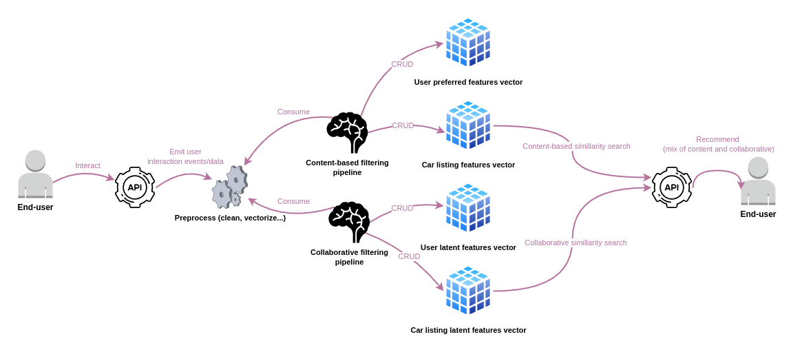
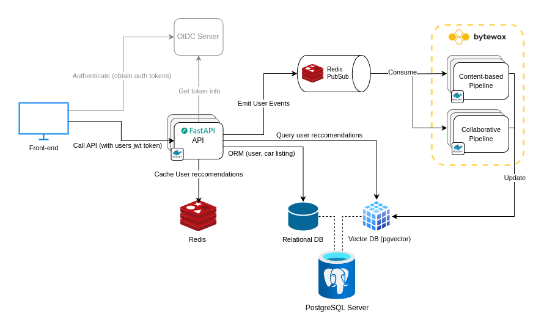
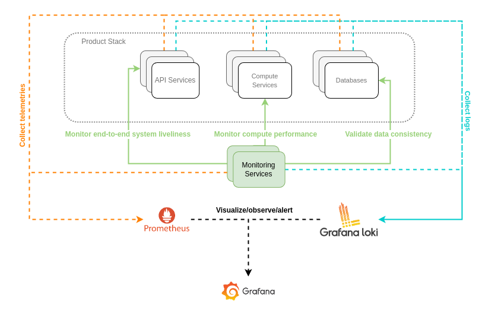
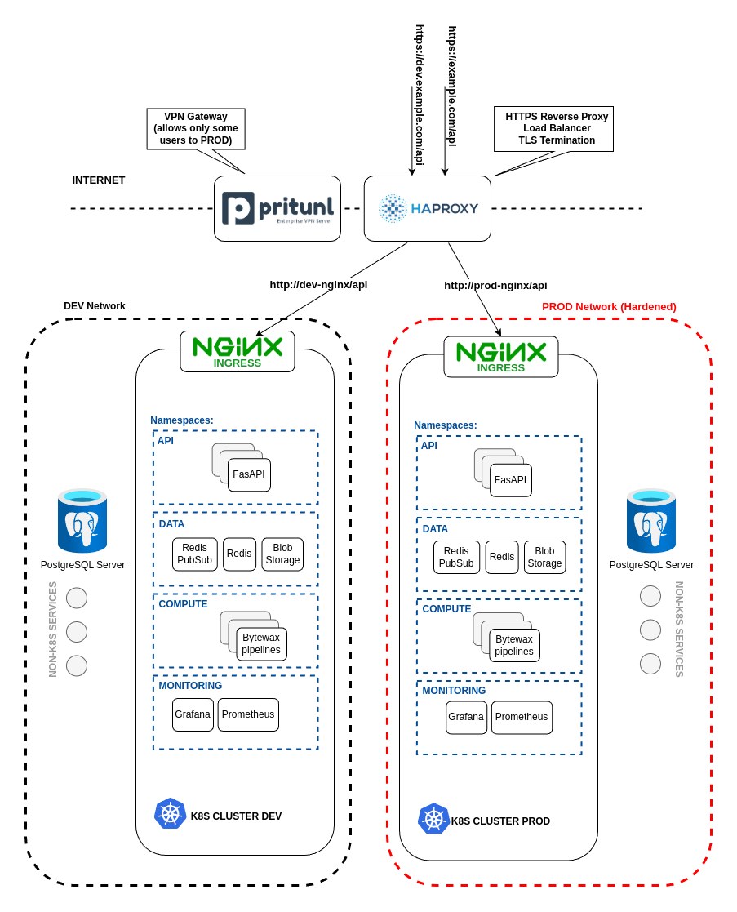
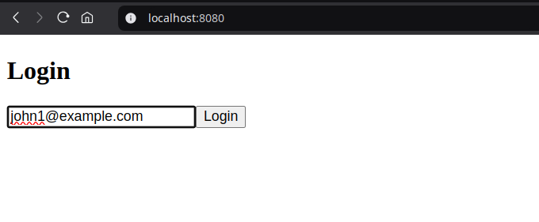
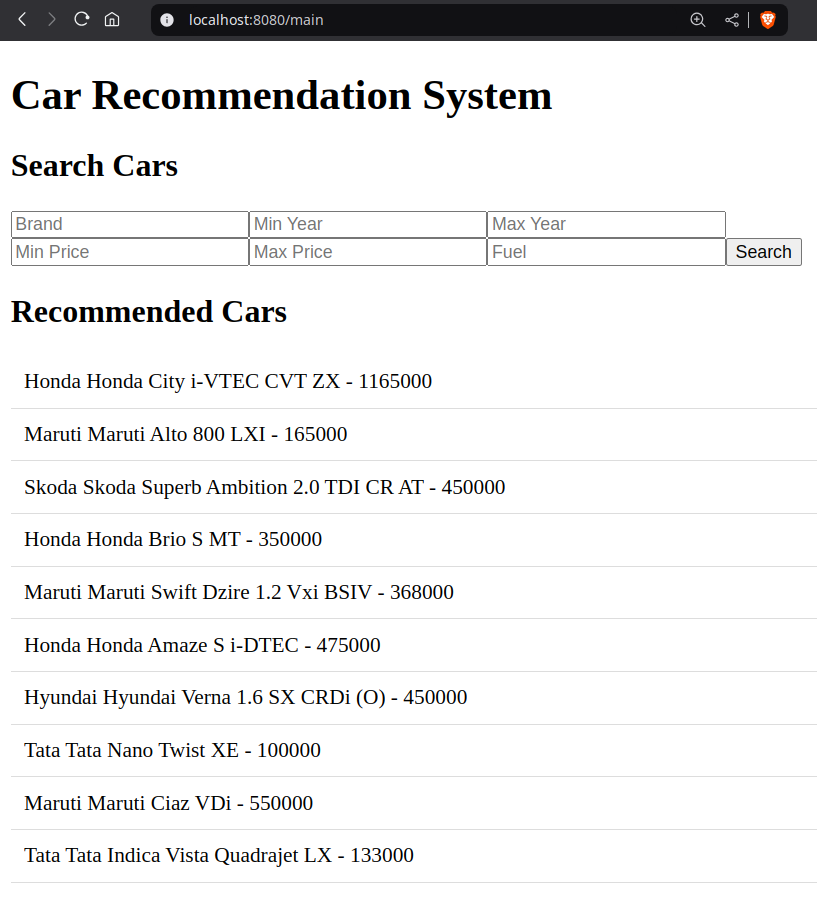
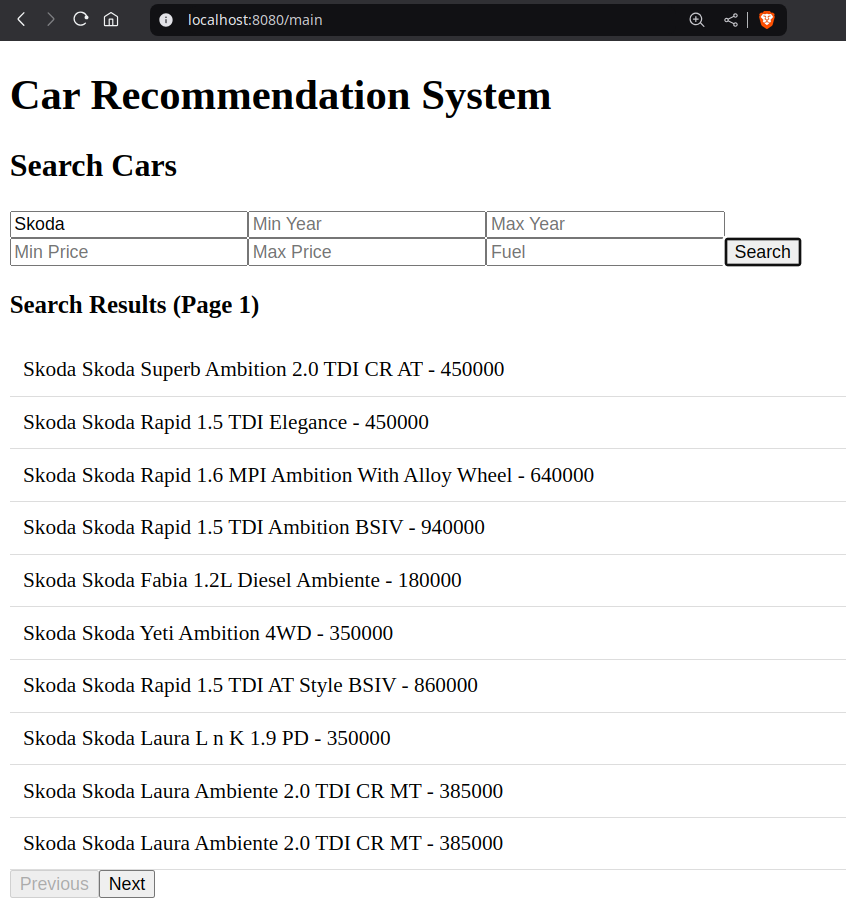
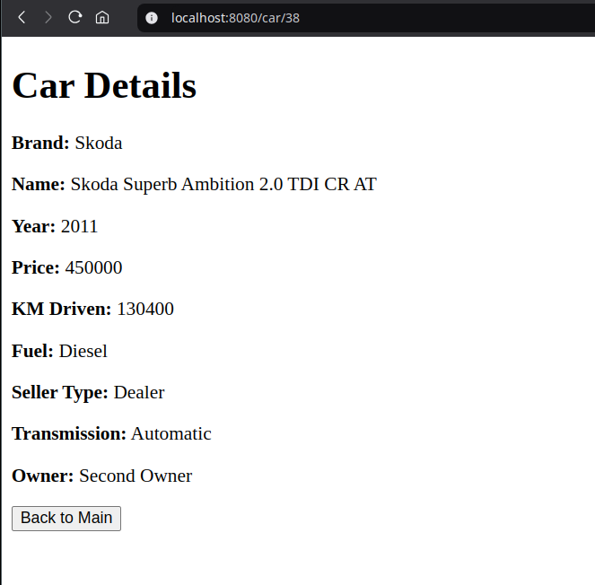

# Recommender

> [!NOTE]
> This project was created as a solution to a hiring assignment. The majority
> of this solution was developed in roughly 2-3 MD (and thus is full of
> assumptions and simplifications). However, the point was to deliver something
> complete within that relatively short time span. The `README.md` is written in
> a way that attempts to explain my thought process.

This repository presents a possible solution to a simple car recommender system
design. The solution primarily focuses on the back-end engineering
aspects of the problem. The front-end was written entirely by AI (xAI Grok 3) and
the data science solution is more or less just a naive placeholder. However, it was
necessary to pick some data science solution as it dictates some parts of the
presented back-end stack, such as the database and the event-handling solution.

The solution presented here consists of:

* [Data science solution](#data-science-solution)
* [Architecture](#architecture)
* [Prototyp](#prototype)

# Data science solution
After a quick research, I essentially ruled out using any complex ML solutions
(since I lack experience and intuition in this domain, making it too
time-consuming). I narrowed it down to two possible solution (ideally a hybrid of both):

1) Content-based filtering
2) Collaborative filtering (Optionally)

Both solutions seem to boil down to computing a "preference" vector for the
user—either based on a real feature set (in the case of content-based
filtering) or a latent feature set (in the case of collaborative filtering)—and
representing each car listing as a feature vector (again, using either real
or latent features). Recommendations for the user are then generated by finding
the car listing feature vectors that are nearest to the user’s "preference"
vector (in this case, using Euclidean distance).

So, a high-level solution could look something like this:



* See the following [jupyter notebook](https://github.com/Embi/notebooks/blob/main/recommender.ipynb) for more.
* The actual vectorization is then done in [init_db.py](backend/init_db.py).

# Architecture
This chapter presents a possible software stack and interactions between its
components. This is by no means THE RIGHT SOLUTION; this is just A SOLUTION.

A possible back-end layer could look something like this. Naturally, the tech
stack largely reflects my previous experience. Redis Pub/Sub was utilized for
its simplicity. Bytewax is a relatively new stream processing framework that is
fairly simple (compared to alternatives, which are mostly Java-based) and very
fast (it is essentially a Python binding for an engine written in Rust).



A possible monitoring and observability solution could be based on Prometheus,
Grafana, and Grafana Loki, along with a custom-made monitoring microservice
that constructs and exposes advanced metrics and telemetry (which can then be
collected by Prometheus and displayed on a Grafana dashboard). A
production-ready solution would also include a tracing solution like Sentry.



The diagram below hints at one way this stack could be deployed in a
cloud-agnostic manner. There are countless ways the infrastructure and
deployment model could be designed, all depending on various external and
internal constraints.



# Prototype
The idea behind the prototype was to implement a reasonable subset of the
product stack presented in the [architecture](#architecture) chapter.

In a nutshell, the goals were:

- To have a functional API microservice that can query basic entities
  from the database (e.g., User, Listing) and emit events related to user
  activity.
- To have a consumer for user activity events (e.g., content or
  collaborative pipelines) that then updates user preference vectors
  accordingly.
- To have a functional vector similarity search.
- To have a simple front-end app that can visualize all this functionality.

> [!NOTE]
> The front-end app was written almost entirely by AI (xAI Grok 3). Only minor
> fixes and adjustments were made by me.
>
> The prompt used to generate the frontend app can be found
> in [frontend-xai-prompt.md](frontend-xai-prompt.md), and the generated
> response is available at [frontend-xai-prompt-result.md](frontend-xai-prompt-result.md).


## How to run the stack

### Prerequisites
* Linux environment
* Docker

### Docker compose

1. run the prototype stack
```bash
docker compose up
```
2. initialize and populate the db with data
```bash
pip install -r dev-requirements.txt
source dev-env.sh
cd backend
python init_db.py
```
3. Open the front-end (http://localhost:8080) app in your browser and log in
   by entering email of one of the dummy user `john1@example.com`.



4. Check default recommendations.



5. Search for "Skoda" listings.



6. Click on a car listing to get its details.



7. Observe that recommendations change after clicking on a listing detail.
