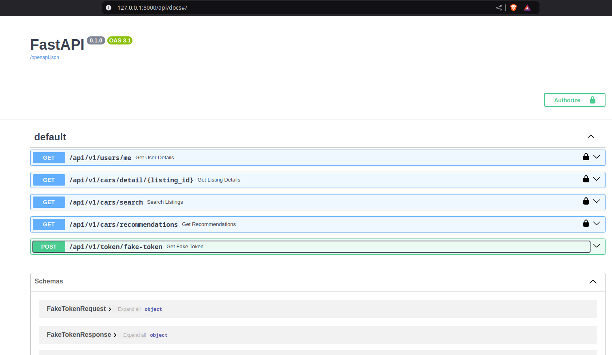
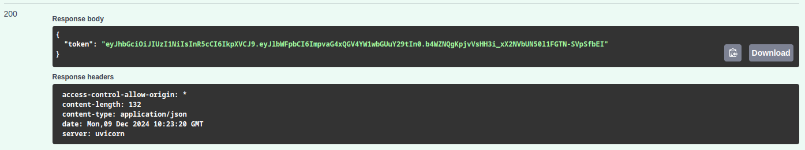
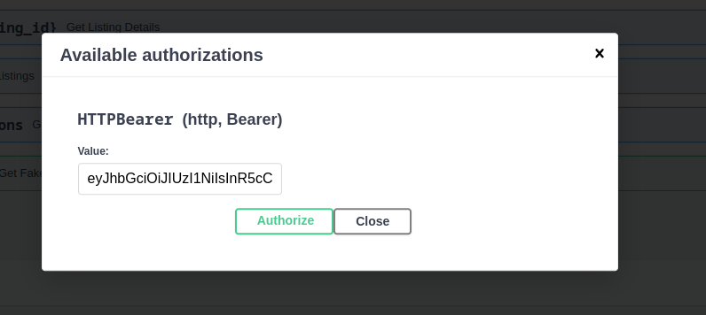
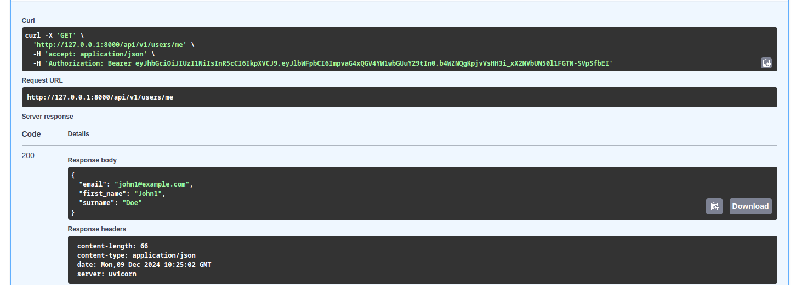
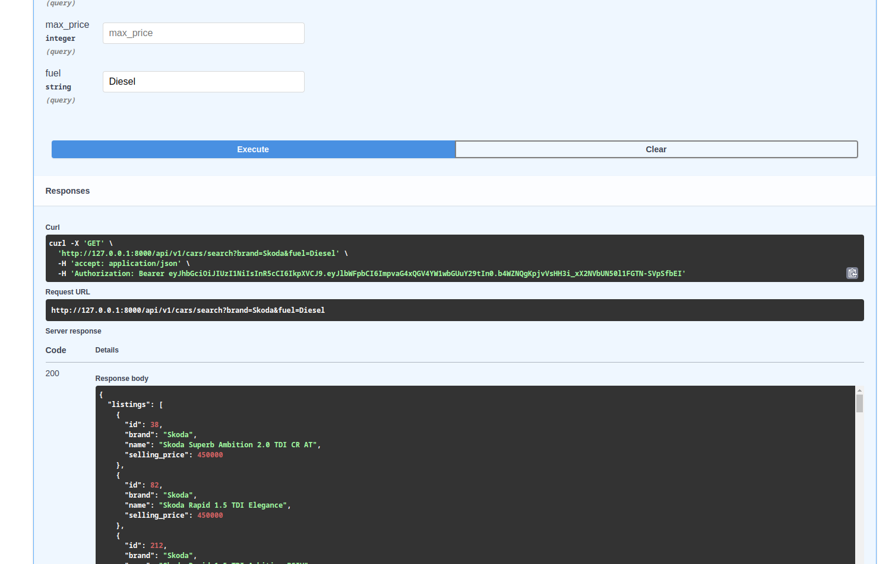
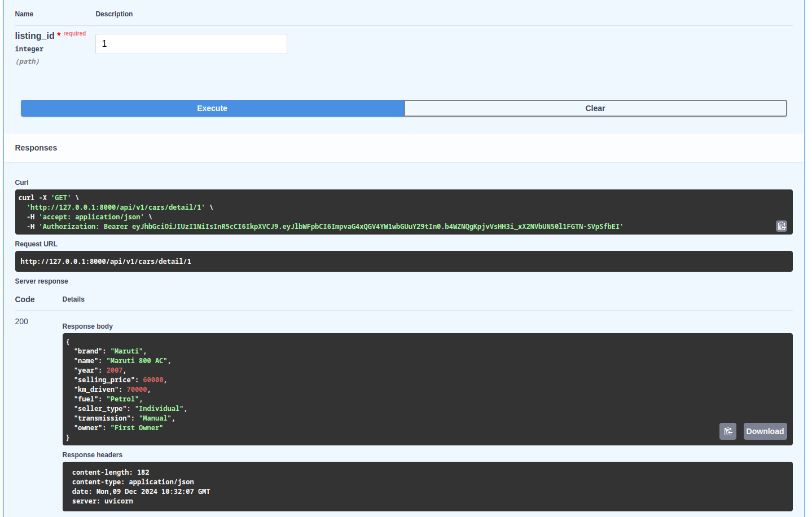
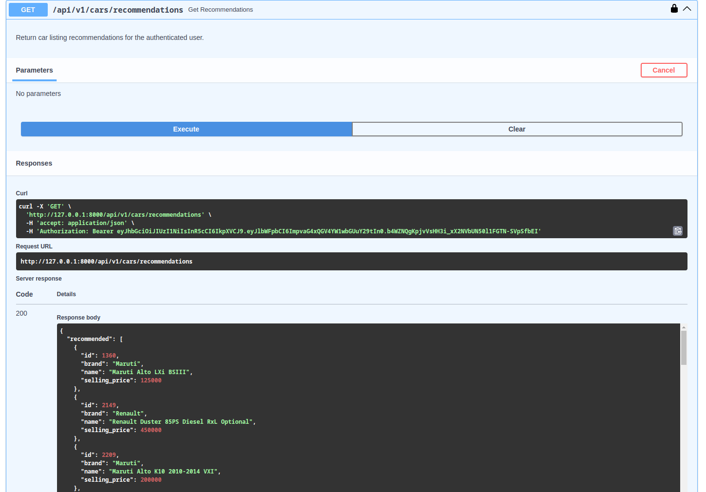

# To interact with the API directly

1. open swagger ui in your browser http://localhost:8080/api/docs#/

2. obtain fake auth token (use the default user "john1@example.com")

3. copy the token value to the swagger ui authorize form

4. get user info

5. search car listings

6. get details about a particular listing

7. get car recommendations for the authenticated user


# Development

### Tests and linters

From the repository root:

1. Install dev requirements.
```bash
pip install -r dev-requirements.txt
```

2. Run tests.
```bash
pytest
```

3. Run pre-commit hooks.
```bash
pre-commit run --all-files
```

### REPL 

For interacting with a running docker compose stack from your REPL console:

1. Setup env variables.
```bash
source dev-env.sh
```
2. Interact using Python console. 
```python
>>> from core.db.models.user import get_user_by_id
>>> u = get_user_by_id(2)
>>> u.email
'john0@example.com'
```
